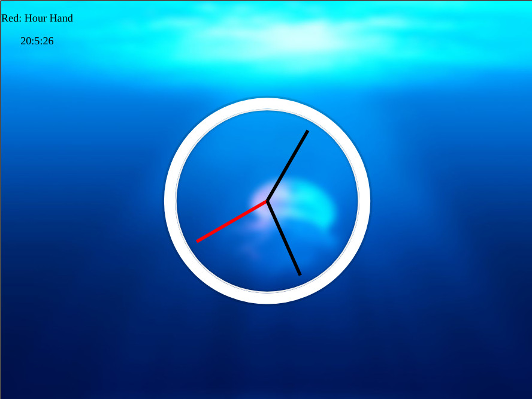

# CSS JS Clock
Takes the current time from Javascript and updates the analog clock based on the current hour, minute, and second.

## Live Demo

Click for a [Live Demo.](http://apps.javierlona.com/css-js-clock/)

## Installing

Download the zip file and launch index.html in your web browser.

## License

This project is licensed under the MIT License - see the [LICENSE](LICENSE) file for details

## Acknowledgments

* [Wes Bos JavaScript30](https://javascript30.com/)
